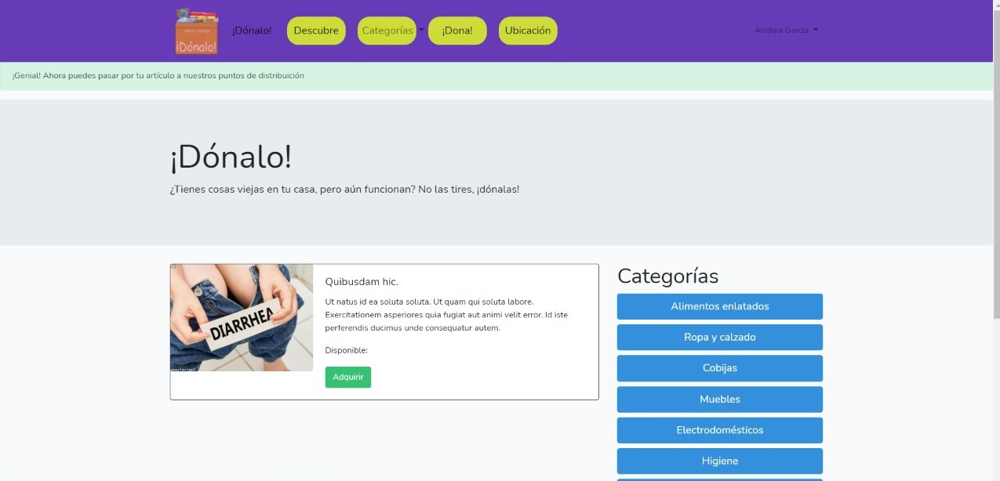
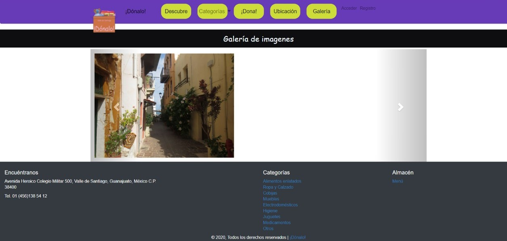
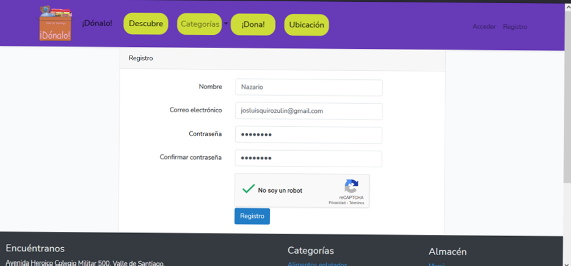

# Dónalo

Donalo es una plataforma para unir donantes y donadores a darle un uso mayor a las cosas. Por ejemplo, alguien que le sobre algún artículo en su casa pero aún estando en buen estado, puede publicarlo y así evitar tirarlo a la basura, es un ganar ganar.

## Tecnologías
Aplicación web con el Framework **Laravel**, **html**, **css**, **bootstrap**, template engine **Blade**, usando **docker** en desarrollo para múltiples entornos.
La aplicación cuenta con autenticación de usuarios, con una base de datos **MySQL**, con ayuda de faker de laravel vienen datos de prueba.
Operaciones CRUD de acuerdo a los permisos y roles del usuario.

## Instalación
Para poner en ejecución el proyecto es necesario:

Instalar dependencias composer

 ```php composer.phar install ```

Correr el DockerFile ya configurado

```docker run```


## Projecto en marcha





<!-- ## License
[MIT license](https://opensource.org/licenses/MIT). -->
